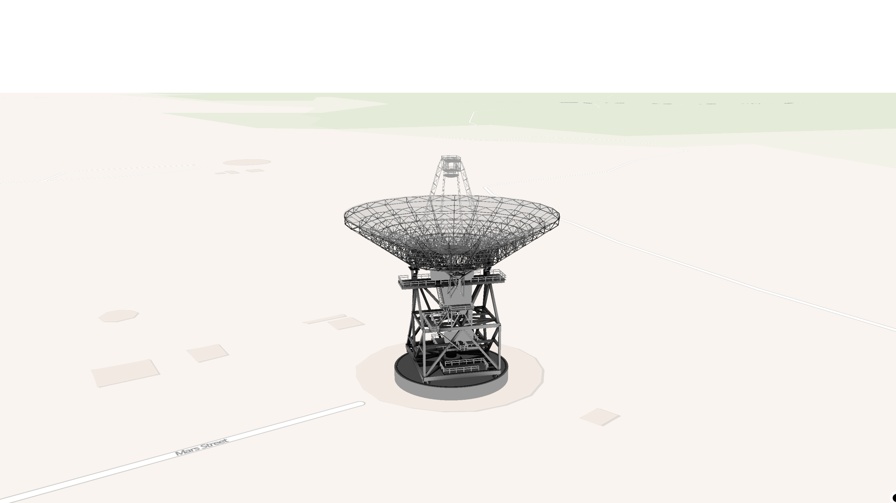

# Maplibre Three World

This library enables developers to manage Three.js objects using a MapLibre-like API, simplifying the addition, control, and interaction of 3D objects on maps.




## Installation

> Note: This library requires `maplibre-gl` and `three` as peer dependencies.  
> Make sure to install them in your project if you haven't already.

```bash
# Install the library
npm install maplibre-three-world

# Install peer dependencies
npm install maplibre-gl three
```


## Supported Versions

To ensure compatibility, please use versions within the following ranges:

- `maplibre-gl`: >=5.0.0
- `three`: >=0.130.0

Using versions outside these ranges may result in unexpected behavior.


## Basic Usage

``` javascript
import { Map } from 'maplibre-gl';
import { ThreeLayer, ThreeModel } from 'maplibre-three-world';

// Initial Map
const map = new Map({
  container: 'map',
  style: 'https://tiles.openfreemap.org/styles/bright',
  zoom: 18,
  center: [148.9819, -35.3981],
  pitch: 60,
  maxPitch: 85,
  canvasContextAttributes: {
    antialias: true,
  },
});

// Create Layer
const layer = new ThreeLayer({
  id: '3d_building',
  minzoom: 16,
  maxzoom: 24,
  renderOutsideBounds: false,
  defaultLight: true,
});

// Create Model
const model = new ThreeModel({
  url: 'https://maplibre.org/maplibre-gl-js/docs/assets/34M_17/34M_17.gltf',
  type: 'gltf',
  lngLatAlt: [148.9819, -35.39847, 0],
  rotation: {
    x: 90,
    y: 0,
    z: 0,
  },
});

// Map on Load
await new Promise(resolve => map.once('style.load', resolve));

// Add Layer
map.addLayer(layer);

// Add Model
model.addTo(layer);
```


## API & Methods

All available classes, methods, and types are documented under the [docs](https://github.com/bruce-yu-studio/maplibre-three-world/tree/master/docs) directory.
For detailed usage, configuration options, and advanced examples, please refer to the documentation there.


## References

This project was inspired by and references:

- [Threebox](https://github.com/jscastro76/threebox)
- [maplibre-three-plugin](https://github.com/dvt3d/maplibre-three-plugin)


## License

This project is released under the **MIT License**.
It is free and open-source software.
